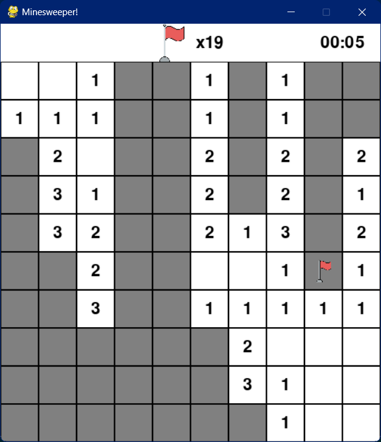

# Minesweeper in python

## Descerizione

Minesweeper realizzato con pygame

  

## comandi
* r per resettare il gioco
* tasto sinistro del mouse per premere una casella
* rotella centrale per togliere una bandierina
* tasto destro per mettere una bandierina

## Software/librerie usate
* [Python]("https://www.python.org/") il linguaggio di programmazione utilizzato
* [Pygame]("https://www.pygame.org/news") la liberia usata
* [Visual Studio Code]("https://code.visualstudio.com/") il text editor usato

## Assets usati
* [bomba]("https://pngimg.com/image/24044")
* [bandiera]("https://www.flaticon.com/free-icon/flag_5515469")

